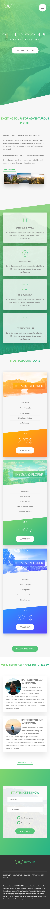

# Landing Page for a tours Company

This is a Practical project(Landing page) for my course with Jonas

## Table of contents

- [Overview](#overview)
  - [The challenge](#the-challenge)
  - [Screenshot](#screenshot)
  - [Links](#links)
- [My process](#my-process)
  - [Built with](#built-with)
- [Author](#author)

## Overview

### The challenge

Users should be able to:

- View the optimal layout for the site depending on their device's screen size
- See hover states for all interactive elements on the page

### Screenshot

### Links

- Live Site URL: [Github pages](https://yasertarek.github.io/Natours-project/index.html)

## My process

### Built with

- Semantic HTML5 markup
- CSS custom properties
- SCSS Preprocessor
## Author

- Linked In - [Yasser Tarek](https://www.linkedin.com/in/yasser-tarek-75b781210/)
- Twitter - [@yasertarek420](https://www.twitter.com/yasertarek420)
